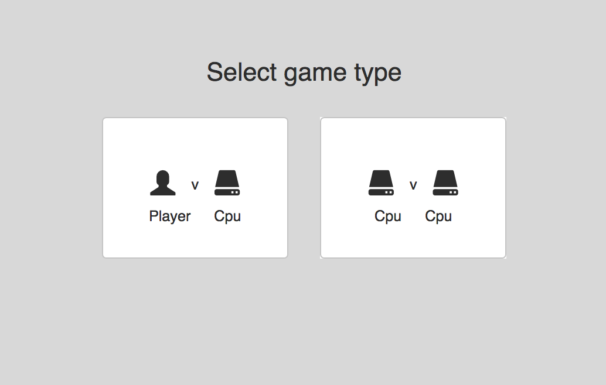
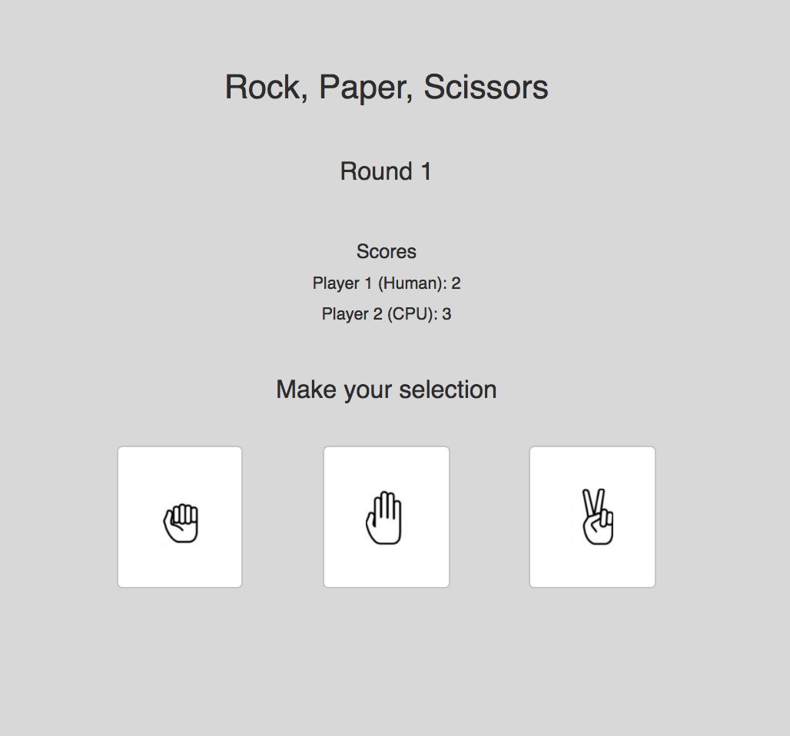
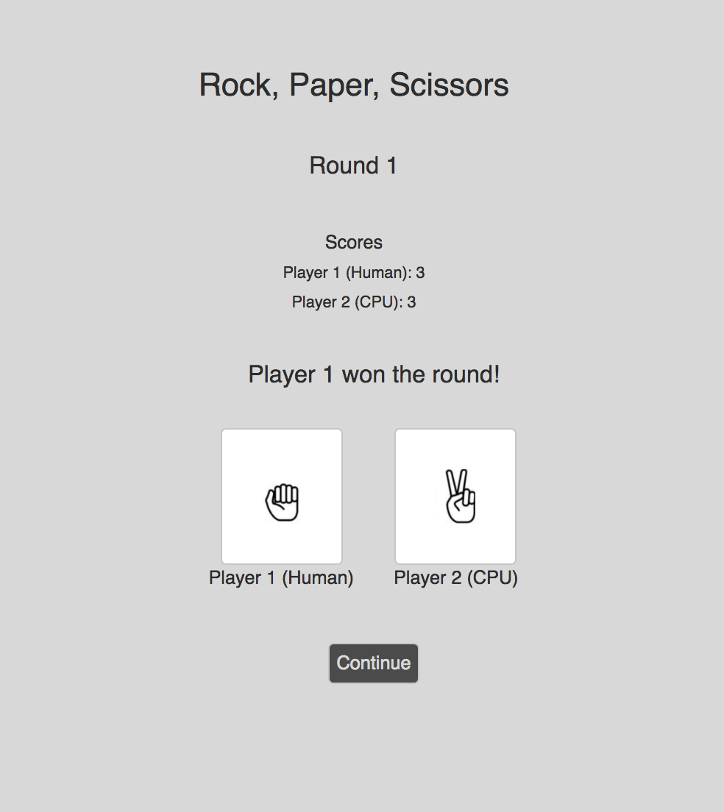
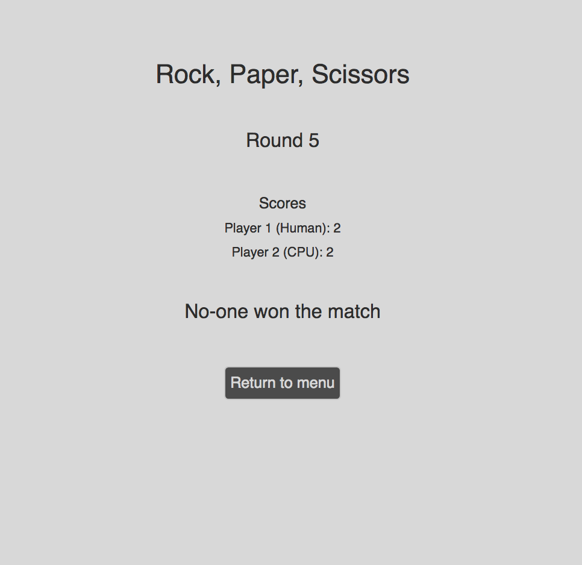

An implementation of the classic Rock, Paper, Scissors game using React and Redux.

Specification

A small web based application that allows you to play best of 5 Rock, Paper, Scissors against a fair computer opponent. The application should be accessed via a web browser and provide a visual interface to be able to play and resolve each round. Upon either player winning 3 out of a potential 5 rounds the game should end with the victor shown.

The application should allow for human vs computer or computer vs computer (simulation) game play.

  

  

  

  

